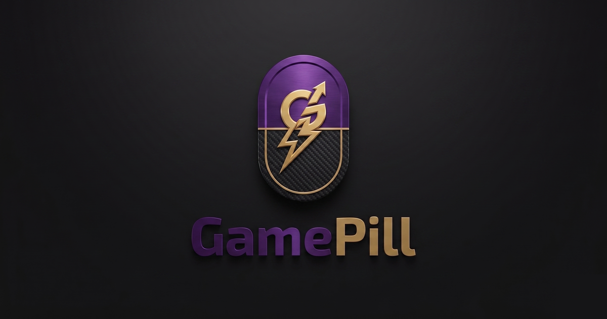

  

<h1 align="center">GamePill</h1>

  Une barre discrète en haut de ton écran qui affiche tes viewers
  et tes stats de jeu en temps réel. Windows 10 / 11. Gratuit.

  <a href="https://github.com/wedoee-collab/GamePill/releases/latest/download/GamePillSetup.exe"><b>Télécharger GamePill</b></a>
  &nbsp;·&nbsp;
  <a href="https://wedoee-collab.github.io/GamePill/">Site web</a>

---

## Qu'est-ce que GamePill ?

GamePill est un overlay léger pour Windows. Une petite « pill » flottante
reste en haut de ton écran et affiche, en temps réel :

- tes **viewers** Twitch, YouTube ou Kick, ton pic et la durée de ton live ;
- tes **stats de jeu** (le jeu est détecté automatiquement) ;
- des **alertes** quand quelqu'un te follow, se sub ou te raid.

Tout se pilote depuis une fenêtre de réglages : tu choisis tes plateformes,
tes jeux et ce que la pill affiche.

## Installation

1. [Télécharge l'installeur](https://github.com/wedoee-collab/GamePill/releases/latest/download/GamePillSetup.exe).
2. Ouvre `GamePillSetup.exe` et suis l'assistant.
   > Si Windows affiche « Windows a protégé votre PC », clique sur
   > « Informations complémentaires » puis « Exécuter quand même ».
3. GamePill apparaît dans ton menu Démarrer.

## Guide rapide

| Étape | Action |
|---|---|
| **La pill** | Clic gauche pour l'agrandir, clic droit maintenu pour la déplacer. |
| **Réglages** | Double-clic sur l'icône GamePill en bas à droite de l'écran. |
| **Connexions** | Réglages → Plateformes → connecte Twitch / YouTube / Kick. |
| **Personnalisation** | Réglages → choisis les jeux suivis, l'affichage et les alertes. |
| **Quitter** | Clic droit sur l'icône → Quitter. |

Les mises à jour sont automatiques.

## Désinstallation

Paramètres Windows → Applications → GamePill → Désinstaller.

## Licence

GamePill est un logiciel **propriétaire**. Le code est visible publiquement
pour la distribution et la transparence, mais toute copie, modification ou
redistribution est interdite. Voir [LICENSE](LICENSE).

© 2026 sm0ke / wedoee-collab. Tous droits réservés.
